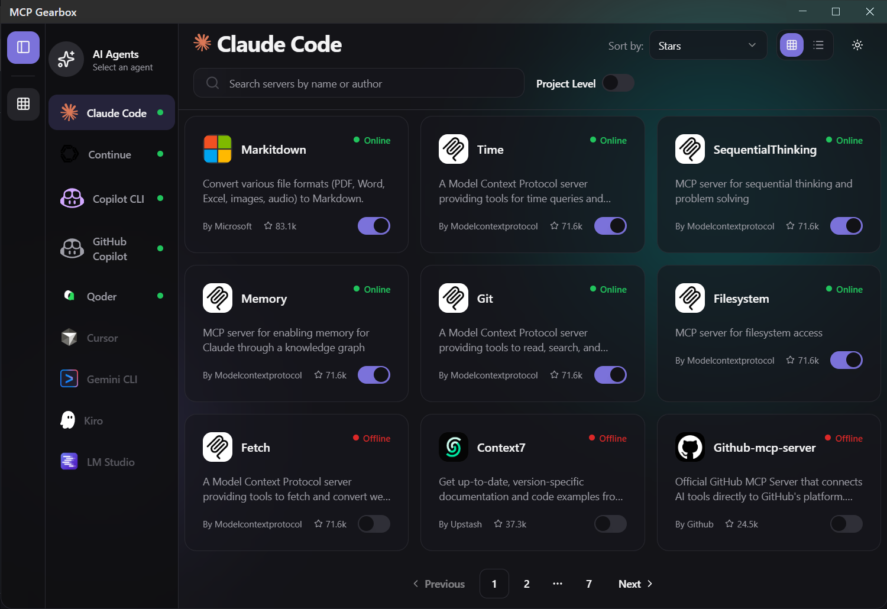

# MCP Gearbox

> A modern desktop application for managing Model Context Protocol (MCP) servers across multiple AI agents

## 📸 Screenshot



[](https://github.com/rohitsoni007/mcp-gearbox/actions/workflows/build.yml)
[](https://opensource.org/licenses/MIT)
[](https://www.electronjs.org/)
[](https://reactjs.org/)
[](https://www.typescriptlang.org/)
[](https://github.com/rohitsoni007/mcp-gearbox)


## 📚 Documentation

For detailed usage instructions, please visit our [documentation](https://rohitsoni007.github.io/mcp-gearbox).

## 🤔 What is MCP Gearbox?

MCP Gearbox is a powerful cross-platform desktop application that simplifies the management of Model Context Protocol (MCP) servers for AI agents like Claude, Kiro, Continue, Copilot, Cursor, Qoder, and others. Built with Electron, React, and TypeScript, this productivity tool provides an intuitive interface to discover, install, configure, and manage MCP servers without touching configuration files. Whether you're a developer, researcher, or AI enthusiast, MCP Gearbox streamlines your workflow with local AI integration and server management capabilities.

### Key Features

As a cutting-edge productivity tool for AI development, MCP Gearbox offers:

- **🔍 Server Discovery** - Browse and search through available MCP servers from the community
- **⚡ One-Click Installation** - Install MCP servers to your AI agents with a single click
- **🎛️ Multi-Agent Support** - Manage servers across multiple AI agents from one interface
- **📊 Server Management** - Enable, disable, and remove servers with ease
- **🔧 Configuration Made Easy** - No need to manually edit JSON configuration files
- **🎨 Modern UI** - Built with shadcn/ui components and Tailwind CSS for a beautiful experience
- **💾 State Persistence** - Your settings and preferences are saved automatically

These features make MCP Gearbox the ultimate productivity tool for developers working with AI assistants.

## 💡 Why MCP Gearbox?

Managing MCP servers manually can be tedious and error-prone. MCP Gearbox eliminates the complexity by offering a code assistant productivity tool that:

- Provides a visual interface for server management
- Automates configuration file updates
- Offers server discovery and recommendations
- Supports multiple AI agents in one place
- Reduces setup time from minutes to seconds

This AI integration tool transforms how developers and researchers work with Model Context Protocol servers, making local AI setup effortless and efficient.

## 💻 Installation

Get started with this AI integration tool in minutes. MCP Gearbox supports all major operating systems.

## 🔧 Requirements

- [uv](https://docs.astral.sh/uv/) for package management
- [Python 3.11+](https://www.python.org/downloads/)
- [Git](https://git-scm.com/downloads)
  

### Download

Get started immediately with our pre-built binaries for maximum convenience:

- **Windows**: `mcp-gearbox-setup.exe`
- **macOS**: `mcp-gearbox.dmg`
- **Linux**: `mcp-gearbox.deb` or `mcp-gearbox.rpm`

This cross-platform AI integration tool is ready to enhance your productivity workflow.

### 🛠️ Build from Source

Build this productivity tool from source to customize it for your specific needs:

```bash
# Clone the repository
git clone https://github.com/rohitsoni007/mcp-gearbox.git
cd mcp-gearbox

# Install dependencies
npm install

# Run in development mode
npm start

# Build for production
npm run make
```

Building from source gives you the flexibility to extend MCP Gearbox as an AI integration tool.

## 🎯 Usage

Unlock the full potential of this productivity tool with these simple steps:

### 🚀 Getting Started

1. **Launch MCP Gearbox** - Open the application
2. **Check Agent Status** - View which AI agents are installed and configured
3. **Browse Servers** - Explore available MCP servers
4. **Install Servers** - Click to add servers to your preferred agents
5. **Manage Configuration** - Enable/disable servers as needed

This intuitive workflow makes managing AI assistants effortless.

### 🖥️ Managing Servers

Effortlessly control your AI assistant ecosystem with these management features:

- **Add a Server**: Browse the server list and click "Install" on any server
- **Remove a Server**: Navigate to your installed servers and click "Remove"
- **Enable/Disable**: Toggle servers on or off without uninstalling

This server management capability makes MCP Gearbox the ultimate productivity tool for AI development.

### 🤖 Supported AI Agents

MCP Gearbox seamlessly integrates with popular AI code assistants and development tools:

| Agent | Support | Notes |
|-------|---------|-------|
| **[GitHub Copilot](https://code.visualstudio.com)** | ✅ |  |
| **[Continue](https://github.com/continuedev/continue)** | ✅ |  |
| **[Kiro](https://kiro.dev)** | ✅ |  |
| **[Cursor](https://cursor.sh)** | ✅ |  |
| **[Claude Code](https://www.claude.com/product/claude-code)** | ✅ |  |
| **[Gemini CLI](https://github.com/google-gemini/gemini-cli)** | ✅ |  |
| **[Qoder](https://qoder.com)** | ✅ |  |
| **[Copilot CLI](https://github.com/github/copilot-cli)** | ✅ |  |
| **[LM Studio](https://lmstudio.ai)** | ✅ |  |

## ⚙️ Technology Stack

- **Framework**: Electron 39 with Electron Forge
- **Frontend**: React 19 with TypeScript
- **Routing**: TanStack Router
- **State Management**: Redux Toolkit with Redux Persist
- **UI Components**: shadcn/ui with Radix UI primitives
- **Styling**: Tailwind CSS 4
- **Build Tool**: Vite (Rolldown)
- **Testing**: Vitest + Playwright

## Development

Join us in improving this AI integration tool for the developer community. We use modern development practices to ensure code quality and maintainability.

### 📁 Project Structure

Our well-organized codebase follows modern development practices for this productivity tool:

```
mcp-gearbox/
├── src/
│   ├── components/     # React components
│   ├── hooks/          # Custom React hooks
│   ├── pages/          # Page components
│   ├── services/       # API and service layer
│   ├── store/          # Redux store and slices
│   ├── types/          # TypeScript type definitions
│   ├── utils/          # Utility functions
│   ├── main.ts         # Electron main process
│   ├── preload.ts      # Electron preload script
│   └── renderer.tsx    # React renderer entry
├── tests/              # E2E tests
└── forge.config.ts     # Electron Forge configuration
```

This modular structure makes MCP Gearbox easy to understand and extend as an AI integration tool.

### 📜 Available Scripts

Streamline your development workflow with these npm scripts for this AI integration tool:

```bash
npm start              # Start development server
npm run build          # Build for production
npm run make           # Create distributable packages
npm run lint           # Run ESLint
npm run format         # Format code with Prettier
npm test               # Run unit tests
npm run test:e2e       # Run end-to-end tests
```

These scripts ensure consistent development practices for contributing to this productivity tool.

### 🧪 Testing

We maintain high quality standards for this productivity tool through comprehensive testing:

```bash
# Unit tests with Vitest
npm test
npm run test:watch
npm run test:coverage

# E2E tests with Playwright
npm run test:e2e
npm run test:e2e:ui
```

Our testing approach ensures MCP Gearbox remains a reliable AI integration tool for developers.

We follow best practices for testing to ensure MCP Gearbox remains a reliable productivity tool.

## 🤝 Contributing

We welcome contributions from the AI development community! Whether you're a seasoned developer or new to AI tools, your input helps make MCP Gearbox better for everyone. Please see our [CONTRIBUTING.md](CONTRIBUTING.md) for details on:

- Code of Conduct
- Development setup
- Submitting pull requests
- Reporting issues
- Coding standards

Join us in building the ultimate productivity tool for AI assistant management.

## 📄 License

This open-source productivity tool is licensed under the MIT License - see the [LICENSE](LICENSE) file for details. The permissive MIT license allows you to use, modify, and distribute MCP Gearbox for both personal and commercial projects.

## 💬 Support

Need help with this AI integration tool or have questions about managing MCP servers? We're here to help:

- **Issues**: [GitHub Issues](https://github.com/rohitsoni007/mcp-gearbox/issues) - Report bugs or request features
- **Discussions**: [GitHub Discussions](https://github.com/rohitsoni007/mcp-gearbox/discussions) - Ask questions and connect with other users

As a productivity tool for AI developers, we strive to provide excellent support for our community.

## 🗺️ Roadmap

Our future plans for enhancing this AI integration tool include:

- [ ] Server configuration editor
- [ ] Custom server addition
- [ ] Server health monitoring
- [ ] Backup and restore configurations
- [ ] Dark/light theme toggle
- [ ] Multi-language support

## 🙏 Acknowledgements

This project is based on the data from [Model Context Protocol Servers](https://github.com/modelcontextprotocol/servers) and [Github MCP Registry](https://github.com/mcp).
This project uses my other project  [MCP-Gearbox-CLI](https://github.com/rohitsoni007/mcp-gearbox-cli).

We're continuously working to improve MCP Gearbox as a productivity tool for the AI development community.

---

**Keywords**: MCP, Model Context Protocol, AI agents, Claude Desktop, Kiro, Electron app, server management, AI tools, desktop application, TypeScript, React, MCP servers, AI configuration, developer tools, AI assistant, local AI, MCP client, AI integration, code assistant, productivity tool, cross-platform app
